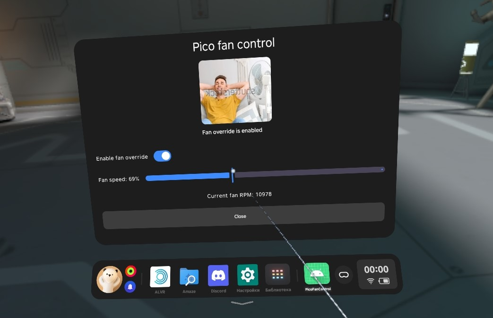

  
# PicoFanControl
### Easy tool to override pico 4 fan speed with root

##

## Requirements

- Pico 4 with root access.

## Usage
1. Install apk.
2. Open and grant root access.
3. Enable fan override and choose desired speed (hardcoded to be at least 50%).

**You can close the app after enabling fan override**

## How it works
Pico 4 has an executable called `gd32ipdclient_test` which communicates with pico's internal MCU and is used in system factory test app to test fan, ipd motor, display, etc. Since this is available in non-rooted ADB, it could also be done through Shizuku.

It is possible to switch the fan into test mode with `setfantestmode 1` subcommand and set it to constant speed with `setfantestspeed` subcommand.

However, it appears it's possible to forcefully fully stop the fan and potentially cause overheating, so caution is needed. This is why i capped minimum speed at 50%.
